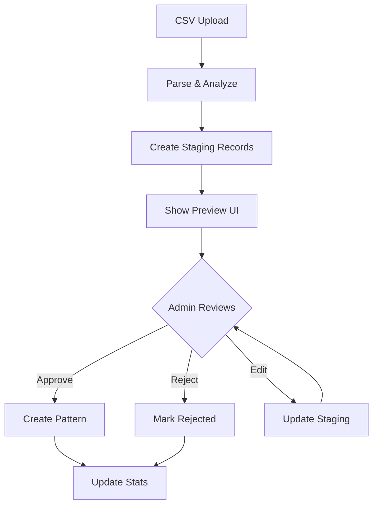

# CSV Import Issues Analysis & Pattern Approval System

## 🔴 Critical Issues Found

### 1. **UUID Validation Mismatch**
**Problem**: The backend generates job IDs with `uuidv4()` but the frontend validation expects UUID format.
```javascript
// Backend: csvImportService.ts
const jobId = uuidv4(); // Generates UUID

// API Route: enhanced-patterns.ts
[param('jobId').isUUID()] // Expects UUID format

// But the job is returned as:
{ jobId: job.id } // This works fine
```
**Status**: ✅ Actually OK - UUID v4 is being used correctly

### 2. **Direct Pattern Creation Without Review** ⚠️
**Problem**: Patterns are created directly in the `decision_patterns` table with `is_active: true`
```javascript
// csvImportService.ts line 359-396
await db.query(
  `INSERT INTO decision_patterns (
    ...
    is_active, // Set to TRUE immediately!
```
**Impact**: All imported patterns go live immediately without review

### 3. **No Error Recovery**
**Problem**: If GPT-4o fails or returns invalid JSON, the entire conversation is skipped
```javascript
// Line 309-311
} catch (error) {
  logger.error('[CSV Import] GPT-4o analysis failed', error);
  return []; // Silently fails
}
```

### 4. **Memory Leak Risk**
**Problem**: Jobs stay in memory for 1 hour after completion
```javascript
// Line 450
if (job.completedAt && (now - job.completedAt.getTime()) > ONE_HOUR) {
```
**Impact**: Large imports could accumulate in memory

### 5. **No Validation of CSV Content**
**Problem**: The CSV parser doesn't validate data quality
- Empty message bodies are processed
- No check for minimum message length
- No validation of phone number format
- Automated messages filtered by hardcoded IDs only

### 6. **Rate Limiting Issues**
**Problem**: No rate limiting on import endpoint
- User could start multiple imports simultaneously
- Could overwhelm OpenAI API with parallel requests

### 7. **No Rollback Mechanism**
**Problem**: If import fails halfway, partial patterns remain
- No transaction wrapping
- No way to undo a bad import

## 🎯 Pattern Approval System Design

### Database Schema Changes

```sql
-- 1. Create staging table for imported patterns
CREATE TABLE pattern_import_staging (
  id SERIAL PRIMARY KEY,
  import_job_id UUID REFERENCES pattern_import_jobs(id),
  
  -- Pattern data (same as decision_patterns)
  pattern_type VARCHAR(50),
  trigger_text TEXT,
  response_template TEXT,
  confidence_score DECIMAL(3,2),
  trigger_examples TEXT[],
  trigger_keywords TEXT[],
  template_variables JSONB,
  
  -- Approval fields
  status VARCHAR(20) DEFAULT 'pending', -- pending, approved, rejected
  reviewed_by UUID REFERENCES users(id),
  reviewed_at TIMESTAMP,
  review_notes TEXT,
  
  -- Metadata
  conversation_preview TEXT, -- Original conversation for context
  created_at TIMESTAMP DEFAULT NOW()
);

-- 2. Add staging reference to pattern_import_jobs
ALTER TABLE pattern_import_jobs 
ADD COLUMN patterns_staged INTEGER DEFAULT 0,
ADD COLUMN patterns_approved INTEGER DEFAULT 0,
ADD COLUMN patterns_rejected INTEGER DEFAULT 0,
ADD COLUMN review_completed BOOLEAN DEFAULT FALSE;
```

### Implementation Flow



### Frontend Changes Needed

#### 1. Import Results Preview
```typescript
// New component: PatternApprovalModal.tsx
interface StagedPattern {
  id: number;
  pattern_type: string;
  trigger_text: string;
  response_template: string;
  confidence_score: number;
  conversation_preview: string;
  status: 'pending' | 'approved' | 'rejected';
}

const PatternApprovalModal = ({ jobId, onComplete }) => {
  const [patterns, setPatterns] = useState<StagedPattern[]>([]);
  const [filter, setFilter] = useState<'all' | 'pending' | 'approved' | 'rejected'>('pending');
  
  return (
    <div className="modal">
      {/* Tabs for filtering */}
      <div className="tabs">
        <button onClick={() => setFilter('pending')}>
          Pending ({patterns.filter(p => p.status === 'pending').length})
        </button>
        {/* ... */}
      </div>
      
      {/* Pattern cards with approve/reject/edit buttons */}
      {patterns.map(pattern => (
        <PatternReviewCard 
          key={pattern.id}
          pattern={pattern}
          onApprove={() => approvePattern(pattern.id)}
          onReject={() => rejectPattern(pattern.id)}
          onEdit={() => openEditModal(pattern)}
        />
      ))}
      
      {/* Bulk actions */}
      <div className="bulk-actions">
        <button onClick={approveAll}>Approve All Pending</button>
        <button onClick={rejectAll}>Reject All Pending</button>
      </div>
    </div>
  );
};
```

#### 2. Pattern Review Card
```typescript
const PatternReviewCard = ({ pattern, onApprove, onReject, onEdit }) => {
  return (
    <div className="border rounded-lg p-4">
      {/* Show original conversation */}
      <div className="bg-gray-50 p-3 rounded mb-3">
        <h4 className="text-sm font-medium mb-2">Original Conversation</h4>
        <pre className="text-xs">{pattern.conversation_preview}</pre>
      </div>
      
      {/* Extracted pattern */}
      <div className="space-y-2">
        <div>
          <span className="text-xs text-gray-500">Trigger:</span>
          <p className="text-sm">{pattern.trigger_text}</p>
        </div>
        <div>
          <span className="text-xs text-gray-500">Response:</span>
          <p className="text-sm">{pattern.response_template}</p>
        </div>
        <div>
          <span className="text-xs text-gray-500">Confidence:</span>
          <span className={`ml-2 ${getConfidenceColor(pattern.confidence_score)}`}>
            {(pattern.confidence_score * 100).toFixed(0)}%
          </span>
        </div>
      </div>
      
      {/* Action buttons */}
      <div className="flex gap-2 mt-4">
        <button onClick={onApprove} className="btn-primary">Approve</button>
        <button onClick={onReject} className="btn-secondary">Reject</button>
        <button onClick={onEdit} className="btn-ghost">Edit</button>
      </div>
    </div>
  );
};
```

### Backend API Changes

#### 1. Modified CSV Import Service
```typescript
// Instead of directly creating patterns:
private async savePattern(pattern: any, jobId: string): Promise<{ staged: boolean }> {
  // Save to staging table instead
  await db.query(
    `INSERT INTO pattern_import_staging (
      import_job_id,
      pattern_type,
      trigger_text,
      response_template,
      confidence_score,
      trigger_examples,
      trigger_keywords,
      template_variables,
      conversation_preview
    ) VALUES ($1, $2, $3, $4, $5, $6, $7, $8, $9)`,
    [jobId, pattern.type, ...]
  );
  
  return { staged: true };
}
```

#### 2. New Approval Endpoints
```typescript
// GET /api/patterns/import/staging/:jobId
router.get('/import/staging/:jobId', async (req, res) => {
  const patterns = await db.query(
    `SELECT * FROM pattern_import_staging 
     WHERE import_job_id = $1 
     ORDER BY confidence_score DESC`,
    [req.params.jobId]
  );
  res.json({ patterns: patterns.rows });
});

// POST /api/patterns/import/approve
router.post('/import/approve', async (req, res) => {
  const { patternIds, jobId } = req.body;
  
  // Begin transaction
  await db.query('BEGIN');
  
  try {
    for (const id of patternIds) {
      // Get staging pattern
      const staged = await db.query(
        'SELECT * FROM pattern_import_staging WHERE id = $1',
        [id]
      );
      
      // Create actual pattern
      await db.query(
        `INSERT INTO decision_patterns (...) VALUES (...)`,
        staged.rows[0]
      );
      
      // Update staging status
      await db.query(
        `UPDATE pattern_import_staging 
         SET status = 'approved', reviewed_by = $1, reviewed_at = NOW()
         WHERE id = $2`,
        [req.user.id, id]
      );
    }
    
    await db.query('COMMIT');
    res.json({ success: true });
  } catch (error) {
    await db.query('ROLLBACK');
    throw error;
  }
});

// POST /api/patterns/import/reject
router.post('/import/reject', async (req, res) => {
  const { patternIds, reason } = req.body;
  
  await db.query(
    `UPDATE pattern_import_staging 
     SET status = 'rejected', 
         reviewed_by = $1, 
         reviewed_at = NOW(),
         review_notes = $2
     WHERE id = ANY($3)`,
    [req.user.id, reason, patternIds]
  );
  
  res.json({ success: true });
});

// PUT /api/patterns/import/staging/:id
router.put('/import/staging/:id', async (req, res) => {
  const { trigger_text, response_template, confidence_score } = req.body;
  
  await db.query(
    `UPDATE pattern_import_staging 
     SET trigger_text = $1,
         response_template = $2,
         confidence_score = $3
     WHERE id = $4`,
    [trigger_text, response_template, confidence_score, req.params.id]
  );
  
  res.json({ success: true });
});
```

## 🛠️ Quick Fixes Needed Now

### 1. Set imported patterns as inactive by default
```javascript
// csvImportService.ts line 388
is_active: false, // Changed from true
```

### 2. Add rate limiting
```javascript
// enhanced-patterns.ts
import rateLimit from 'express-rate-limit';

const importLimiter = rateLimit({
  windowMs: 60 * 60 * 1000, // 1 hour
  max: 1, // 1 import per hour
  message: 'Please wait before importing another CSV'
});

router.post('/import/csv',
  authenticate,
  roleGuard(['admin']),
  importLimiter, // Add this
  csvUpload.single('file'),
  ...
```

### 3. Add transaction support
```javascript
// csvImportService.ts
private async processImportJob(jobId: string, messages: MessageData[]) {
  const client = await db.connect();
  
  try {
    await client.query('BEGIN');
    // ... process patterns ...
    await client.query('COMMIT');
  } catch (error) {
    await client.query('ROLLBACK');
    throw error;
  } finally {
    client.release();
  }
}
```

### 4. Add validation
```javascript
// Before processing
if (messages.length === 0) {
  throw new Error('No valid messages found in CSV');
}

if (messages.length > 10000) {
  throw new Error('CSV contains too many messages (max 10,000)');
}
```

## 📋 Implementation Priority

### Phase 1: Critical Fixes (Do Now)
1. ✅ Set `is_active: false` for imported patterns
2. ✅ Add rate limiting to prevent abuse
3. ✅ Add basic validation checks

### Phase 2: Approval System (Next Sprint)
1. Create staging table migration
2. Modify import service to use staging
3. Build approval UI components
4. Add approval API endpoints

### Phase 3: Enhanced Features (Future)
1. Bulk editing capabilities
2. Pattern similarity detection
3. Import history and rollback
4. Pattern quality scoring
5. A/B testing for imported patterns

## 🎯 Recommended Immediate Actions

1. **Deploy hotfix** to set imported patterns as inactive
2. **Add rate limiting** to prevent API abuse
3. **Document** the CSV format requirements clearly
4. **Create staging table** for pattern review workflow
5. **Build approval UI** before allowing production use

The system works but needs these safety mechanisms before being used in production!