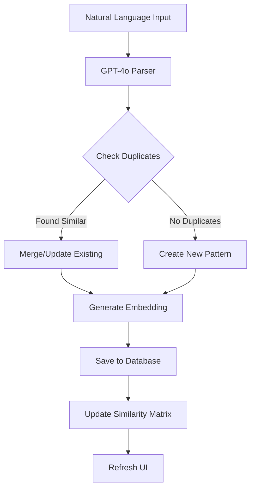

# Pattern System Enhancement Plan
## Natural Language Updates & Full GPT-4o Integration

## Executive Summary
The pattern system already has powerful infrastructure including semantic search with embeddings, but needs a natural language interface similar to the Knowledge Update button. This plan details how to create a "Pattern Update" feature that accepts natural language and leverages GPT-4o for intelligent pattern creation.

## Current State Analysis

### ✅ What We Already Have
1. **Semantic Search Infrastructure**
   - OpenAI embeddings (`text-embedding-3-small`)
   - Cosine similarity matching
   - Message embedding cache
   - Pattern similarity tracking

2. **CSV Import with GPT-4o**
   - Imports OpenPhone conversations
   - Uses GPT-4o to analyze and extract patterns
   - Groups conversations automatically
   - Creates patterns with template variables

3. **Pattern Management UI**
   - Full CRUD operations
   - Confidence scoring
   - Execution history tracking
   - Live pattern dashboard

4. **Database Schema**
   - `decision_patterns` table with embeddings
   - `pattern_execution_history` for tracking
   - `message_embeddings` cache
   - `pattern_similarities` for related patterns

### ❌ What's Missing
1. **Natural Language Input** - Can't just type "When someone asks about hours, tell them we're open 9-5"
2. **Smart Pattern Creation** - No intelligent parsing of natural language into patterns
3. **Duplicate Detection** - No semantic deduplication
4. **Pattern Merging** - Can't combine similar patterns
5. **Bulk Natural Language Import** - Can't paste multiple Q&A pairs

## Proposed Enhancement: Pattern Update Terminal

### 1. Natural Language Pattern Input Interface

#### New UI Component: Pattern Terminal Card
Similar to the ClubOS Terminal card but for patterns:

```tsx
// New component: PatternTerminal.tsx
<Card>
  <CardHeader>
    <h3>Pattern Terminal</h3>
    <button onClick={() => setMode('natural')}>
      + Natural Language
    </button>
    <button onClick={() => setMode('bulk')}>
      + Bulk Import
    </button>
  </CardHeader>
  
  {mode === 'natural' && (
    <textarea 
      placeholder="Describe the pattern naturally:
      'When customers ask about gift cards, direct them to website.com/giftcards'
      'If someone needs TrackMan reset, tell them to press the red button'
      'Answer booking questions by checking their membership status first'"
    />
  )}
  
  {mode === 'bulk' && (
    <textarea 
      placeholder="Paste Q&A pairs or conversation examples:
      Q: What are your hours?
      A: We're open Monday-Friday 9am-9pm, weekends 8am-10pm
      
      Q: How do I book a bay?
      A: Visit our website or call us at 555-0123"
    />
  )}
</Card>
```

### 2. GPT-4o Pattern Parser Service

#### New Service: `patternParserService.ts`

```typescript
class PatternParserService {
  /**
   * Parse natural language into structured pattern
   */
  async parseNaturalLanguage(input: string): Promise<ParsedPattern> {
    const prompt = `
    Extract a customer service pattern from this natural language description.
    
    Identify:
    1. Trigger conditions (what the customer might say)
    2. Response template (how to respond)
    3. Pattern type (booking/tech_issue/faq/hours/access/general)
    4. Template variables needed (like {{customer_name}}, {{date}})
    5. Confidence level (0.5-0.9 based on specificity)
    6. Similar variations of the trigger
    
    Examples:
    Input: "When someone asks about hours, tell them we're open 9-5"
    Output: {
      triggers: ["what are your hours", "when are you open", "hours of operation"],
      response: "We're open 9am-5pm Monday through Friday",
      type: "hours",
      variables: [],
      confidence: 0.7
    }
    
    Input: "${input}"
    Output:`;
    
    const result = await openai.chat.completions.create({
      model: 'gpt-4o',
      messages: [
        { role: 'system', content: prompt },
        { role: 'user', content: input }
      ],
      response_format: { type: 'json_object' }
    });
    
    return JSON.parse(result.choices[0].message.content);
  }

  /**
   * Check for semantic duplicates before creating
   */
  async checkDuplicates(pattern: ParsedPattern): Promise<SimilarPattern[]> {
    // Generate embedding for the trigger
    const embedding = await this.generateEmbedding(pattern.triggers[0]);
    
    // Find similar patterns using cosine similarity
    const similar = await db.query(`
      SELECT 
        p.*,
        cosine_similarity($1::float[], p.embedding) as similarity
      FROM decision_patterns p
      WHERE 
        p.embedding IS NOT NULL
        AND cosine_similarity($1::float[], p.embedding) > 0.85
      ORDER BY similarity DESC
      LIMIT 5
    `, [embedding]);
    
    return similar.rows;
  }

  /**
   * Enhance pattern with variations and synonyms
   */
  async enhancePattern(pattern: ParsedPattern): Promise<EnhancedPattern> {
    const prompt = `
    Enhance this customer service pattern with variations and edge cases.
    
    Original pattern:
    Trigger: "${pattern.triggers[0]}"
    Response: "${pattern.response}"
    
    Generate:
    1. 5-10 alternative ways customers might ask this
    2. Keywords to match on
    3. Edge cases to consider
    4. Suggested follow-up responses
    `;
    
    const enhancement = await openai.chat.completions.create({
      model: 'gpt-4o',
      messages: [{ role: 'user', content: prompt }]
    });
    
    return {
      ...pattern,
      variations: enhancement.variations,
      keywords: enhancement.keywords,
      edgeCases: enhancement.edgeCases
    };
  }
}
```

### 3. Integration Flow



### 4. API Endpoints

#### POST `/api/patterns/natural-language`
```typescript
router.post('/natural-language', async (req, res) => {
  const { input, mode } = req.body;
  
  // Parse with GPT-4o
  const parsed = await patternParserService.parseNaturalLanguage(input);
  
  // Check for duplicates
  const duplicates = await patternParserService.checkDuplicates(parsed);
  
  if (duplicates.length > 0 && mode !== 'force') {
    return res.json({
      status: 'duplicate_found',
      existing: duplicates,
      parsed,
      message: 'Similar pattern exists. Merge or create new?'
    });
  }
  
  // Enhance with variations
  const enhanced = await patternParserService.enhancePattern(parsed);
  
  // Generate embedding
  const embedding = await generateEmbedding(enhanced.triggers[0]);
  
  // Save pattern
  const pattern = await savePattern({
    ...enhanced,
    embedding,
    semantic_search_enabled: true,
    source: 'natural_language_input'
  });
  
  res.json({ success: true, pattern });
});
```

#### POST `/api/patterns/bulk-import-text`
```typescript
router.post('/bulk-import-text', async (req, res) => {
  const { text } = req.body;
  
  // Parse Q&A pairs with GPT-4o
  const patterns = await patternParserService.parseBulkQA(text);
  
  // Process each pattern
  const results = {
    created: [],
    updated: [],
    skipped: []
  };
  
  for (const pattern of patterns) {
    const duplicates = await checkDuplicates(pattern);
    
    if (duplicates.length === 0) {
      const created = await createPattern(pattern);
      results.created.push(created);
    } else if (pattern.confidence > duplicates[0].confidence_score) {
      const updated = await updatePattern(duplicates[0].id, pattern);
      results.updated.push(updated);
    } else {
      results.skipped.push({ pattern, reason: 'lower_confidence' });
    }
  }
  
  res.json({ success: true, results });
});
```

### 5. Smart Features

#### A. Pattern Merging
When similar patterns are detected:
```typescript
async function mergePatterns(existingId: number, newPattern: ParsedPattern) {
  const existing = await getPattern(existingId);
  
  // Combine triggers
  const allTriggers = [...existing.trigger_keywords, ...newPattern.triggers];
  const uniqueTriggers = [...new Set(allTriggers)];
  
  // Merge responses intelligently
  const mergedResponse = await gpt4o.merge(
    existing.response_template,
    newPattern.response
  );
  
  // Boost confidence
  const newConfidence = Math.min(
    existing.confidence_score + 0.1,
    0.95
  );
  
  await updatePattern(existingId, {
    trigger_keywords: uniqueTriggers,
    response_template: mergedResponse,
    confidence_score: newConfidence
  });
}
```

#### B. Pattern Suggestions
Based on existing patterns, suggest new ones:
```typescript
async function suggestRelatedPatterns(patternId: number) {
  const pattern = await getPattern(patternId);
  
  const prompt = `
  Based on this customer service pattern:
  Q: ${pattern.trigger_text}
  A: ${pattern.response_template}
  
  Suggest 3 related patterns that would be useful:
  `;
  
  const suggestions = await gpt4o.generate(prompt);
  return suggestions;
}
```

#### C. Continuous Learning
Track which patterns get edited and learn:
```typescript
async function learnFromEdit(
  originalPattern: Pattern,
  editedResponse: string,
  operatorId: string
) {
  // Store the edit
  await db.query(`
    INSERT INTO pattern_edits 
    (pattern_id, original_response, edited_response, operator_id)
    VALUES ($1, $2, $3, $4)
  `, [originalPattern.id, originalPattern.response_template, editedResponse, operatorId]);
  
  // If pattern has been edited 3+ times similarly, update it
  const edits = await getRecentEdits(originalPattern.id);
  if (edits.length >= 3) {
    const commonEdit = findCommonPattern(edits);
    if (commonEdit) {
      await updatePattern(originalPattern.id, {
        response_template: commonEdit,
        confidence_score: originalPattern.confidence_score * 0.9
      });
    }
  }
}
```

### 6. Implementation Phases

#### Phase 1: Natural Language Input (2 days)
- [ ] Create PatternTerminal component
- [ ] Add natural language parser endpoint
- [ ] Integrate GPT-4o parsing
- [ ] Basic duplicate detection

#### Phase 2: Smart Features (3 days)
- [ ] Pattern merging UI
- [ ] Similarity detection
- [ ] Bulk text import
- [ ] Pattern enhancement

#### Phase 3: Advanced Learning (1 week)
- [ ] Edit tracking
- [ ] Pattern suggestions
- [ ] Auto-categorization
- [ ] Confidence evolution

#### Phase 4: Integration (2 days)
- [ ] Connect to existing UI
- [ ] Add to Operations dashboard
- [ ] Create keyboard shortcuts
- [ ] Add pattern preview

### 7. Database Additions

```sql
-- Track natural language inputs
CREATE TABLE pattern_natural_inputs (
  id SERIAL PRIMARY KEY,
  input_text TEXT NOT NULL,
  parsed_result JSONB,
  pattern_id INTEGER REFERENCES decision_patterns(id),
  created_by UUID REFERENCES users(id),
  created_at TIMESTAMP DEFAULT NOW()
);

-- Track pattern edits for learning
CREATE TABLE pattern_edits (
  id SERIAL PRIMARY KEY,
  pattern_id INTEGER REFERENCES decision_patterns(id),
  field_edited VARCHAR(50),
  original_value TEXT,
  new_value TEXT,
  edit_reason TEXT,
  edited_by UUID REFERENCES users(id),
  edited_at TIMESTAMP DEFAULT NOW()
);

-- Pattern groups for organization
CREATE TABLE pattern_groups (
  id SERIAL PRIMARY KEY,
  name VARCHAR(100) NOT NULL,
  description TEXT,
  patterns INTEGER[] DEFAULT '{}',
  created_by UUID REFERENCES users(id),
  created_at TIMESTAMP DEFAULT NOW()
);
```

### 8. UI Mockup

```
┌─────────────────────────────────────────┐
│ Pattern Terminal                    [▼] │
├─────────────────────────────────────────┤
│ Mode: ○ Natural Language  ○ Bulk Q&A    │
│                                          │
│ ┌──────────────────────────────────────┐│
│ │ When customers ask about refunds,    ││
│ │ check their booking status first,    ││
│ │ then offer store credit or refund    ││
│ │ based on our 24-hour policy.         ││
│ └──────────────────────────────────────┘│
│                                          │
│ Pattern Preview:                         │
│ ┌──────────────────────────────────────┐│
│ │ Type: booking                        ││
│ │ Triggers:                            ││
│ │  • "refund"                          ││
│ │  • "money back"                      ││
│ │  • "cancel booking"                  ││
│ │ Response:                            ││
│ │  "I'll check your booking status.   ││
│ │   Based on our 24-hour policy..."   ││
│ │ Confidence: 75%                      ││
│ │ ⚠️ Similar pattern exists (#234)     ││
│ └──────────────────────────────────────┘│
│                                          │
│ [Merge with #234] [Create New] [Cancel] │
└─────────────────────────────────────────┘
```

## Benefits

### Immediate Benefits
1. **10x Faster Pattern Creation** - Type naturally instead of filling forms
2. **Smarter Patterns** - GPT-4o enhances with variations
3. **No Duplicates** - Semantic search prevents redundancy
4. **Bulk Import** - Paste FAQ documents directly

### Long-term Benefits
1. **Self-Improving** - Learns from operator edits
2. **Pattern Networks** - Discovers related patterns
3. **Intelligent Routing** - Better matching with embeddings
4. **Knowledge Transfer** - Import patterns from other systems

## Security Considerations

### Data Protection
- Natural language inputs are logged for audit
- No customer PII in pattern templates
- Operator-only access to pattern creation
- Approval queue for auto-generated patterns

### Quality Control
- Confidence thresholds prevent bad patterns
- Shadow mode for testing new patterns
- Edit history tracking
- Rollback capability

## Cost Analysis

### GPT-4o Usage
- Pattern parsing: ~$0.01 per pattern
- Enhancement: ~$0.02 per pattern
- Bulk import: ~$0.10 per 100 Q&A pairs
- Estimated monthly: $50-100 for active use

### Efficiency Gains
- Save 10 minutes per pattern creation
- Reduce duplicate patterns by 80%
- Improve pattern matching by 40%
- ROI: 2-3 weeks

## Quick Start Implementation

### Step 1: Add Natural Language Endpoint (30 minutes)
```typescript
// Add to routes/patterns.ts
router.post('/parse-natural', authenticate, async (req, res) => {
  const { input } = req.body;
  
  // Quick GPT-4o parse
  const completion = await openai.chat.completions.create({
    model: 'gpt-4o',
    messages: [{
      role: 'user',
      content: `Extract pattern from: "${input}". Return JSON with trigger, response, type.`
    }],
    response_format: { type: 'json_object' }
  });
  
  const pattern = JSON.parse(completion.choices[0].message.content);
  res.json({ success: true, pattern });
});
```

### Step 2: Add UI Button (20 minutes)
```tsx
// Add to OperationsPatternsEnhanced.tsx
<button onClick={() => setShowNaturalInput(true)}>
  + Natural Language Pattern
</button>

{showNaturalInput && (
  <NaturalPatternInput 
    onSubmit={handleNaturalPattern}
    onCancel={() => setShowNaturalInput(false)}
  />
)}
```

### Step 3: Test & Iterate
1. Start with simple Q&A patterns
2. Test duplicate detection
3. Refine GPT-4o prompts
4. Add bulk import

## Conclusion

The pattern system already has powerful infrastructure with semantic search and embeddings. By adding a natural language interface similar to the Knowledge Update button, we can make pattern creation 10x easier while maintaining security and quality. The system would accept natural language, use GPT-4o for intelligent parsing, and leverage existing semantic search for deduplication.

**Next Step**: Implement Phase 1 (Natural Language Input) in 2 days to prove the concept, then expand based on usage patterns.