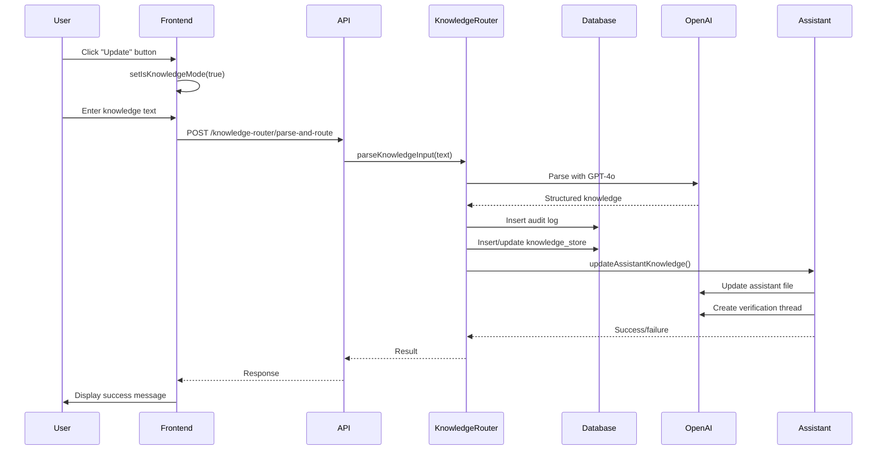

# ClubOS Terminal Card Update Button - Complete Technical Report

## Executive Summary
The "Update" button on the ClubOS Terminal card in the operator interface is a knowledge management feature that allows administrators to add new information directly to the AI system. This report details the complete data flow from UI interaction to database storage and OpenAI Assistant updates.

## 1. Frontend Components

### 1.1 Location and UI
- **File**: `ClubOSV1-frontend/src/components/RequestForm.tsx`
- **Lines**: 626-639
- **Component**: Update button in the ClubOS Terminal card header

### 1.2 Button Behavior
```typescript
// Line 626-639
<button
  type="button"
  onClick={() => {
    setIsKnowledgeMode(true);    // Activates knowledge mode
    setIsTicketMode(false);      // Deactivates ticket mode
    // Keeps smartAssistEnabled as is
  }}
  className="px-4 py-1.5 text-xs font-medium rounded-full..."
  disabled={isSubmitting || demoMode}
>
  {isKnowledgeMode ? '✓ Update Mode' : '+ Update'}
</button>
```

### 1.3 Knowledge Mode Processing
When the form is submitted in knowledge mode (lines 234-276):
1. Sets `isProcessing` to true
2. Calls the knowledge-router API endpoint
3. Sends the input text to be parsed and routed
4. Displays success/error messages

## 2. API Layer

### 2.1 Endpoint Configuration
- **Route**: `POST /api/knowledge-router/parse-and-route`
- **File**: `ClubOSV1-backend/src/routes/knowledge-router.ts`
- **Lines**: 53-100
- **Authentication**: Requires admin role

### 2.2 Request Flow
```typescript
// Line 241-243
const response = await http.post(
  `knowledge-router/parse-and-route`,
  { input: data.requestDescription }
);
```

## 3. Backend Processing

### 3.1 Knowledge Router Service
**File**: `ClubOSV1-backend/src/services/knowledgeRouter.ts`

#### Step 1: Parse Natural Language Input (lines 48-101)
- Uses OpenAI GPT-4o to parse user input
- Extracts:
  - Intent: add/update/overwrite
  - Category: type of knowledge
  - Target assistant: emergency/booking/tech/brand
  - Value: actual knowledge content

#### Step 2: Store in Database (lines 203-299)
Two database operations occur:

##### A. Knowledge Audit Log
```sql
INSERT INTO knowledge_audit_log 
(action, category, key, new_value, user_id, assistant_target, metadata)
VALUES ($1, $2, $3, $4, $5, $6, $7)
```

##### B. Knowledge Store
```sql
INSERT INTO knowledge_store (key, value, confidence, verification_status, source_type, created_by)
VALUES ($1, $2, $3, $4, $5, $6)
ON CONFLICT (key) DO UPDATE SET...
```

#### Step 3: Route to OpenAI Assistant (lines 106-177)
- Maps target assistant to appropriate OpenAI Assistant ID
- Updates the assistant's knowledge file
- Creates verification thread

### 3.2 Assistant Service Integration
**File**: `ClubOSV1-backend/src/services/assistantService.ts`

The `updateAssistantKnowledge` method (lines 667-782):
1. Updates the assistant's knowledge file
2. Creates a thread to inform the assistant
3. Verifies the knowledge was stored
4. Returns success/failure status

## 4. Database Schema

### 4.1 knowledge_audit_log Table
```sql
CREATE TABLE knowledge_audit_log (
  id UUID PRIMARY KEY DEFAULT gen_random_uuid(),
  timestamp TIMESTAMP DEFAULT NOW(),
  action VARCHAR(50) NOT NULL,        -- 'add', 'update', 'overwrite'
  category VARCHAR(100),
  key TEXT,
  new_value TEXT,
  user_id UUID,
  assistant_target VARCHAR(50),        -- 'emergency', 'booking', 'tech', 'brand'
  metadata JSONB DEFAULT '{}'
);
```

### 4.2 knowledge_store Table
```sql
CREATE TABLE knowledge_store (
  id UUID PRIMARY KEY DEFAULT gen_random_uuid(),
  key VARCHAR(255) UNIQUE NOT NULL,
  value JSONB NOT NULL,
  confidence DOUBLE PRECISION DEFAULT 0.5,
  verification_status VARCHAR(20) DEFAULT 'learned',
  source_type VARCHAR(50),
  source_count INTEGER DEFAULT 1,
  created_by UUID,
  created_at TIMESTAMP DEFAULT NOW(),
  updated_at TIMESTAMP DEFAULT NOW(),
  superseded_by UUID
);
```

## 5. Data Flow Sequence



## 6. Key Features

### 6.1 Intent Types
- **add**: Adds new information
- **update**: Modifies existing knowledge
- **overwrite**: Replaces entire category

### 6.2 Target Assistants
- **emergency**: Fire, medical, security issues
- **booking**: Reservations, access control
- **tech**: TrackMan, simulators, hardware
- **brand**: Company info, marketing, pricing

### 6.3 Storage Strategy
- Stores knowledge in both audit log (for history) and knowledge_store (for searching)
- Uses structured keys: `{assistant}.{category}.{key}`
- Maintains confidence scores and verification status
- Supports superseding old knowledge on overwrites

## 7. Security and Permissions

### 7.1 Authentication
- Requires valid JWT token
- Admin role required for knowledge updates
- User ID tracked for audit purposes

### 7.2 Validation
- Input validated for required fields
- OpenAI parsing validates structure
- Database constraints ensure data integrity

## 8. Error Handling

### 8.1 Frontend
- Displays toast notifications for success/failure
- Disables button during submission
- Clears form on success

### 8.2 Backend
- Try-catch blocks at each processing step
- Logs errors with context
- Returns meaningful error messages
- Continues even if OpenAI update fails (data still saved to DB)

## 9. Performance Considerations

### 9.1 Asynchronous Processing
- OpenAI API calls are async
- Database operations use connection pooling
- Frontend shows loading state during processing

### 9.2 Optimization
- Knowledge stored with indexes on key field
- Confidence scores allow filtering by reliability
- Superseding mechanism prevents duplicate knowledge

## 10. Recommendations for Future Improvements

### 10.1 Immediate Enhancements
1. Add preview of parsed knowledge before submission
2. Implement bulk knowledge upload capability
3. Add knowledge validation rules

### 10.2 Long-term Improvements
1. Knowledge versioning system
2. Approval workflow for sensitive updates
3. Analytics on knowledge usage
4. Automatic knowledge extraction from conversations
5. Knowledge conflict detection

## Conclusion

The ClubOS Terminal Update button provides a sophisticated knowledge management system that:
1. Accepts natural language input from administrators
2. Uses AI to parse and structure the knowledge
3. Stores it in a searchable database with audit trails
4. Updates OpenAI Assistants for immediate use
5. Provides verification and error handling

The system is well-architected with clear separation of concerns, proper error handling, and maintains data integrity throughout the process. The dual storage approach (audit log + knowledge store) ensures both historical tracking and efficient retrieval.