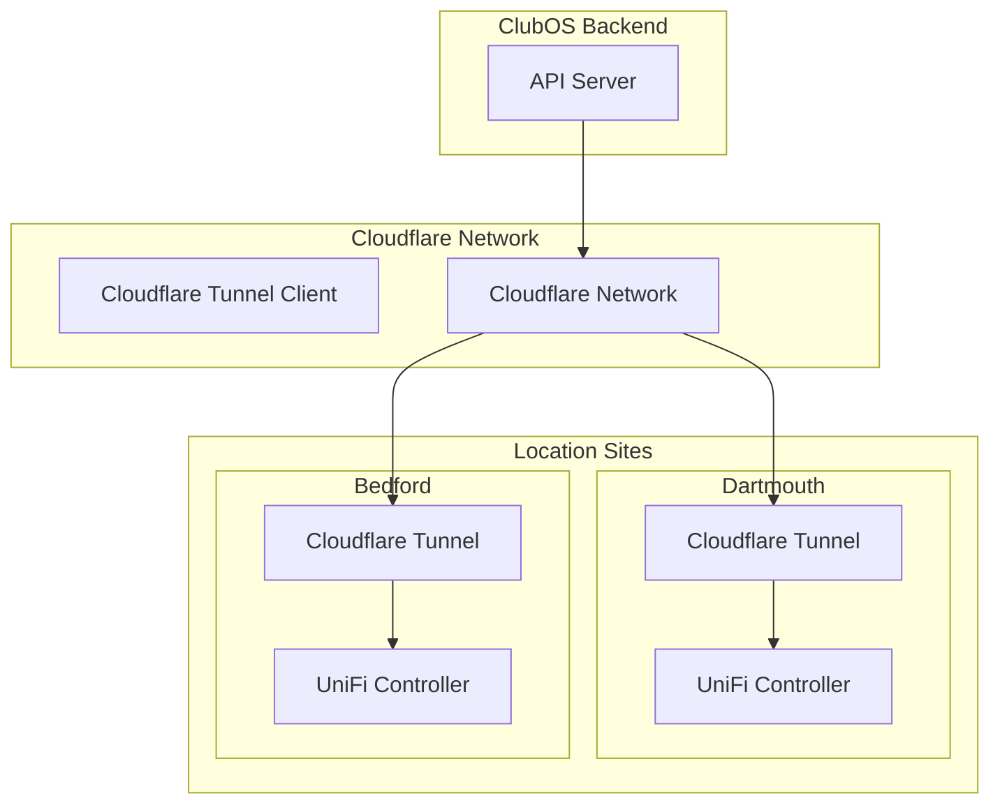

# UniFi Access + Cloudflare Tunnel Integration Plan
## Comprehensive Refactoring Strategy

---

## 🎯 Executive Summary

Refactor the UniFi Access door control system from port forwarding to Cloudflare Tunnels for improved security, reliability, and multi-location scalability.

**Current State**: Port forwarding on 12445, cloud proxy fallback, single active location
**Target State**: Cloudflare Tunnels for all locations, unified access, enhanced security

---

## 📋 Phase 1: Infrastructure Setup (Week 1)

### 1.1 Cloudflare Tunnel Architecture



### 1.2 Cloudflare Tunnel Setup Per Location

```bash
# Install cloudflared at each location
curl -L https://github.com/cloudflare/cloudflared/releases/latest/download/cloudflared-linux-amd64 -o cloudflared
chmod +x cloudflared

# Create tunnel for each location
cloudflared tunnel create dartmouth-unifi
cloudflared tunnel create bedford-unifi
cloudflared tunnel create stratford-unifi
cloudflared tunnel create bayerslake-unifi
cloudflared tunnel create truro-unifi
```

### 1.3 Tunnel Configuration Template

```yaml
# config.yml for each location
tunnel: <tunnel-id>
credentials-file: /etc/cloudflared/<tunnel-id>.json

ingress:
  # UniFi Access Controller
  - hostname: dartmouth-unifi.clubos.internal
    service: https://localhost:12445
    originRequest:
      noTLSVerify: true
      connectTimeout: 30s
      
  # UniFi Network Controller (optional)
  - hostname: dartmouth-network.clubos.internal
    service: https://localhost:8443
    originRequest:
      noTLSVerify: true
      
  # Catch-all
  - service: http_status:404
```

---

## 📂 Phase 2: Code Refactoring (Week 1-2)

### 2.1 New Service Architecture

```typescript
// src/services/cloudflare/CloudflareTunnelManager.ts
export class CloudflareTunnelManager {
  private tunnels: Map<string, TunnelConfig>;
  
  constructor() {
    this.initializeTunnels();
  }
  
  private initializeTunnels() {
    this.tunnels = new Map([
      ['dartmouth', {
        hostname: 'dartmouth-unifi.clubos.internal',
        port: 12445,
        protocol: 'https'
      }],
      ['bedford', {
        hostname: 'bedford-unifi.clubos.internal',
        port: 12445,
        protocol: 'https'
      }]
      // ... other locations
    ]);
  }
  
  getTunnelUrl(location: string, path: string): string {
    const config = this.tunnels.get(location.toLowerCase());
    if (!config) throw new Error(`Unknown location: ${location}`);
    
    return `${config.protocol}://${config.hostname}:${config.port}${path}`;
  }
}
```

### 2.2 Refactored UniFi Service

```typescript
// src/services/unifi/UniFiAccessService.ts
import { CloudflareTunnelManager } from '../cloudflare/CloudflareTunnelManager';

export class UniFiAccessService {
  private tunnelManager: CloudflareTunnelManager;
  private cache: NodeCache;
  
  constructor() {
    this.tunnelManager = new CloudflareTunnelManager();
    this.cache = new NodeCache({ stdTTL: 60 }); // 1 minute cache
  }
  
  async unlockDoor(location: string, doorId: string, duration: number = 5): Promise<UnlockResult> {
    const url = this.getApiUrl(location, `/doors/${doorId}/unlock`);
    
    try {
      const response = await this.authenticatedRequest(url, {
        method: 'POST',
        body: JSON.stringify({ duration })
      });
      
      await this.logDoorAccess(location, doorId, 'unlock', response.success);
      
      return {
        success: response.success,
        message: response.message,
        timestamp: new Date().toISOString()
      };
    } catch (error) {
      await this.handleError(error, location, doorId);
      throw error;
    }
  }
  
  private getApiUrl(location: string, path: string): string {
    // Use Cloudflare tunnel for all locations
    return this.tunnelManager.getTunnelUrl(location, `/api/v1/developer${path}`);
  }
  
  private async authenticatedRequest(url: string, options: RequestInit) {
    const token = await this.getAccessToken();
    
    return fetch(url, {
      ...options,
      headers: {
        'Authorization': `Bearer ${token}`,
        'Content-Type': 'application/json',
        ...options.headers
      },
      // Cloudflare tunnel handles SSL
      agent: new https.Agent({
        rejectUnauthorized: false
      })
    });
  }
}
```

### 2.3 Simplified Route Handler

```typescript
// src/routes/unifi-doors.ts
import { UniFiAccessService } from '../services/unifi/UniFiAccessService';
import { authenticate, requireRole } from '../middleware/auth';

const router = Router();
const unifiService = new UniFiAccessService();

// Unlock door endpoint
router.post('/doors/:location/:doorKey/unlock', 
  authenticate, 
  requireRole(['admin', 'operator']),
  async (req, res) => {
    const { location, doorKey } = req.params;
    const { duration = 5 } = req.body;
    
    try {
      const doorId = await unifiService.getDoorId(location, doorKey);
      const result = await unifiService.unlockDoor(location, doorId, duration);
      
      res.json({
        success: true,
        data: result
      });
    } catch (error) {
      logger.error('Door unlock failed:', error);
      res.status(500).json({
        success: false,
        error: 'Failed to unlock door'
      });
    }
  }
);

// Get all doors status
router.get('/doors',
  authenticate,
  requireRole(['admin', 'operator']),
  async (req, res) => {
    try {
      const doors = await unifiService.getAllDoorsStatus();
      res.json({
        success: true,
        data: doors
      });
    } catch (error) {
      logger.error('Failed to get doors status:', error);
      res.status(500).json({
        success: false,
        error: 'Failed to retrieve door status'
      });
    }
  }
);
```

### 2.4 Environment Configuration

```env
# Cloudflare Tunnel Configuration
CLOUDFLARE_ACCOUNT_ID=your-account-id
CLOUDFLARE_API_TOKEN=your-api-token

# UniFi Access Tokens (per location)
UNIFI_DARTMOUTH_TOKEN=xxx
UNIFI_BEDFORD_TOKEN=xxx
UNIFI_STRATFORD_TOKEN=xxx
UNIFI_BAYERSLAKE_TOKEN=xxx
UNIFI_TRURO_TOKEN=xxx

# Door Configuration
DOORS_CONFIG_PATH=./config/doors.json

# Features
ENABLE_DOOR_CACHE=true
DOOR_CACHE_TTL=60
ENABLE_DOOR_WEBHOOKS=true
WEBHOOK_URL=https://your-webhook.com
```

### 2.5 Door Configuration File

```json
// config/doors.json
{
  "locations": {
    "dartmouth": {
      "name": "Dartmouth",
      "tunnel": "dartmouth-unifi.clubos.internal",
      "doors": {
        "office": {
          "id": "4cea8c1f-b02a-4331-b8ab-4323ec537058",
          "name": "Office Door",
          "defaultDuration": 5
        },
        "staff": {
          "id": "staff-door-id",
          "name": "Staff Door",
          "defaultDuration": 10
        }
      }
    },
    "bedford": {
      "name": "Bedford",
      "tunnel": "bedford-unifi.clubos.internal",
      "doors": {
        "front": {
          "id": "bedford-front-id",
          "name": "Front Door",
          "defaultDuration": 5
        }
      }
    }
  }
}
```

---

## 🧪 Phase 3: Testing Strategy (Week 2)

### 3.1 Unit Tests

```typescript
// __tests__/services/UniFiAccessService.test.ts
describe('UniFiAccessService', () => {
  let service: UniFiAccessService;
  
  beforeEach(() => {
    service = new UniFiAccessService();
  });
  
  describe('unlockDoor', () => {
    it('should unlock door successfully', async () => {
      const result = await service.unlockDoor('dartmouth', 'office', 5);
      expect(result.success).toBe(true);
    });
    
    it('should handle network errors gracefully', async () => {
      // Mock network failure
      jest.spyOn(global, 'fetch').mockRejectedValue(new Error('Network error'));
      
      await expect(service.unlockDoor('dartmouth', 'office', 5))
        .rejects.toThrow('Network error');
    });
  });
});
```

### 3.2 Integration Tests

```typescript
// __tests__/integration/door-unlock.test.ts
describe('Door Unlock Integration', () => {
  it('should unlock door via API', async () => {
    const response = await request(app)
      .post('/api/unifi-doors/doors/dartmouth/office/unlock')
      .set('Authorization', `Bearer ${validToken}`)
      .send({ duration: 5 });
      
    expect(response.status).toBe(200);
    expect(response.body.success).toBe(true);
  });
});
```

### 3.3 End-to-End Testing Script

```bash
#!/bin/bash
# test-door-access.sh

echo "Testing Cloudflare Tunnel Door Access"

# Test each location
LOCATIONS=("dartmouth" "bedford" "stratford" "bayerslake" "truro")

for location in "${LOCATIONS[@]}"; do
  echo "Testing $location..."
  
  # Test tunnel connectivity
  curl -s "https://${location}-unifi.clubos.internal/health" || echo "Tunnel not available"
  
  # Test door unlock
  curl -X POST "https://api.clubos.com/unifi-doors/doors/${location}/office/unlock" \
    -H "Authorization: Bearer $TEST_TOKEN" \
    -H "Content-Type: application/json" \
    -d '{"duration": 5}'
done
```

---

## 🚀 Phase 4: Deployment (Week 3)

### 4.1 Deployment Checklist

- [ ] **Infrastructure**
  - [ ] Install cloudflared at each location
  - [ ] Create Cloudflare tunnels
  - [ ] Configure tunnel routing
  - [ ] Test tunnel connectivity

- [ ] **Backend**
  - [ ] Deploy new UniFiAccessService
  - [ ] Update environment variables
  - [ ] Deploy door configuration
  - [ ] Run migration scripts

- [ ] **Frontend**
  - [ ] Update API endpoints if needed
  - [ ] Test Commands page
  - [ ] Test Remote Actions Bar
  - [ ] Verify error handling

- [ ] **Monitoring**
  - [ ] Set up Cloudflare Analytics
  - [ ] Configure error alerts
  - [ ] Set up uptime monitoring
  - [ ] Create dashboard

### 4.2 Rollback Plan

```bash
# Quick rollback script
#!/bin/bash

# Revert to port forwarding mode
export UNIFI_USE_CLOUDFLARE=false
export UNIFI_USE_REMOTE_ACCESS=true

# Restart services
pm2 restart clubos-backend

# Notify team
curl -X POST $SLACK_WEBHOOK -d '{"text":"Rolled back to port forwarding mode"}'
```

### 4.3 Migration Script

```typescript
// scripts/migrate-to-cloudflare.ts
async function migrateToCloudflare() {
  console.log('Starting Cloudflare migration...');
  
  // 1. Test all tunnel connections
  await testTunnelConnections();
  
  // 2. Verify door configurations
  await verifyDoorConfigurations();
  
  // 3. Update database
  await updateDatabaseSchema();
  
  // 4. Switch traffic
  await switchToCloudflare();
  
  console.log('Migration complete!');
}
```

---

## 📊 Phase 5: Monitoring & Optimization (Ongoing)

### 5.1 Monitoring Setup

```typescript
// src/monitoring/DoorAccessMonitor.ts
export class DoorAccessMonitor {
  private metrics: Map<string, Metric>;
  
  trackUnlock(location: string, doorId: string, duration: number, success: boolean) {
    const key = `${location}:${doorId}`;
    
    if (!this.metrics.has(key)) {
      this.metrics.set(key, {
        totalUnlocks: 0,
        successfulUnlocks: 0,
        failedUnlocks: 0,
        averageDuration: 0,
        lastUnlock: null
      });
    }
    
    const metric = this.metrics.get(key)!;
    metric.totalUnlocks++;
    
    if (success) {
      metric.successfulUnlocks++;
    } else {
      metric.failedUnlocks++;
    }
    
    metric.lastUnlock = new Date();
    
    // Send to monitoring service
    this.sendToDatadog(metric);
  }
}
```

### 5.2 Performance Optimization

```typescript
// src/cache/DoorStatusCache.ts
export class DoorStatusCache {
  private cache: RedisClient;
  private ttl: number = 30; // 30 seconds
  
  async getDoorStatus(location: string, doorId: string): Promise<DoorStatus | null> {
    const key = `door:${location}:${doorId}`;
    const cached = await this.cache.get(key);
    
    if (cached) {
      return JSON.parse(cached);
    }
    
    return null;
  }
  
  async setDoorStatus(location: string, doorId: string, status: DoorStatus) {
    const key = `door:${location}:${doorId}`;
    await this.cache.setex(key, this.ttl, JSON.stringify(status));
  }
}
```

---

## 🔒 Security Enhancements

### 6.1 Enhanced Authentication

```typescript
// src/auth/UniFiAuthManager.ts
export class UniFiAuthManager {
  private tokens: Map<string, TokenInfo>;
  
  async getToken(location: string): Promise<string> {
    // Check for cached valid token
    if (this.hasValidToken(location)) {
      return this.tokens.get(location)!.token;
    }
    
    // Refresh token
    return this.refreshToken(location);
  }
  
  private async refreshToken(location: string): Promise<string> {
    // Implement OAuth2 flow or API key rotation
    const newToken = await this.requestNewToken(location);
    
    this.tokens.set(location, {
      token: newToken,
      expiresAt: Date.now() + 3600000 // 1 hour
    });
    
    return newToken;
  }
}
```

### 6.2 Rate Limiting

```typescript
// src/middleware/rateLimiter.ts
export const doorUnlockRateLimit = rateLimit({
  windowMs: 60 * 1000, // 1 minute
  max: 10, // 10 unlocks per minute
  message: 'Too many unlock requests',
  standardHeaders: true,
  legacyHeaders: false,
  
  keyGenerator: (req) => {
    // Rate limit per user and location
    return `${req.user.id}:${req.params.location}`;
  }
});
```

---

## 📈 Success Metrics

### Key Performance Indicators
- **Response Time**: < 2 seconds for door unlock
- **Success Rate**: > 99.5% successful unlocks
- **Uptime**: 99.9% availability
- **Security**: Zero unauthorized access attempts

### Monitoring Dashboard
- Real-time door status across all locations
- Unlock history and audit trail
- Tunnel health status
- Error rate tracking
- User activity analytics

---

## 🎯 Benefits of Cloudflare Tunnel Approach

1. **Security**
   - No exposed ports
   - Zero Trust Network Access
   - Encrypted tunnel connections
   - DDoS protection

2. **Scalability**
   - Easy to add new locations
   - No firewall configuration needed
   - Centralized management

3. **Reliability**
   - Automatic failover
   - Built-in health checks
   - Connection persistence

4. **Performance**
   - Global Cloudflare network
   - Optimized routing
   - Built-in caching

5. **Maintenance**
   - No port forwarding rules
   - Simplified network topology
   - Easier troubleshooting

---

## 📅 Timeline

| Week | Phase | Deliverables |
|------|-------|-------------|
| 1 | Infrastructure | Cloudflare tunnels deployed |
| 1-2 | Development | Refactored services |
| 2 | Testing | All tests passing |
| 3 | Deployment | Production rollout |
| 4+ | Optimization | Performance tuning |

---

## 🚨 Risk Mitigation

| Risk | Impact | Mitigation |
|------|--------|------------|
| Tunnel downtime | High | Fallback to cloud proxy |
| Authentication failures | Medium | Token caching & refresh |
| Network latency | Low | Response caching |
| Configuration errors | Medium | Validation & testing |

---

## 📝 Next Steps

1. **Immediate Actions**
   - Review and approve plan
   - Set up Cloudflare account
   - Provision tunnel credentials

2. **Development Tasks**
   - Create feature branch
   - Implement CloudflareTunnelManager
   - Refactor UniFi services
   - Write comprehensive tests

3. **Deployment Preparation**
   - Document configuration
   - Create runbooks
   - Train support team
   - Schedule maintenance window

---

This plan provides a clean, secure, and scalable solution for UniFi Access integration using Cloudflare Tunnels, eliminating the complexity and security risks of port forwarding while maintaining all existing functionality.