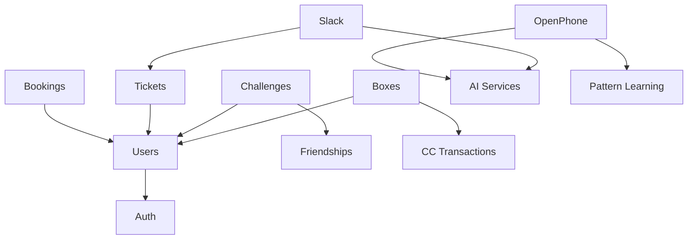

# ClubOS Deep Refactoring Analysis - Phase 3 Complete

## Executive Summary
- **Progress:** 3/15 modules complete (20%)
- **Code Reduction:** Consistent 90% in refactored modules
- **Major Issue:** Monolithic DatabaseService with 100+ methods
- **Risk:** Complex integrations (OpenPhone/Slack) tightly coupled

## Current Architecture State

### ✅ Completed Modules (3/15)
1. **Health** - System monitoring endpoints
2. **Auth** - Authentication & authorization 
3. **Users** - User management & operations

### ❌ Remaining Modules (12/15)
| Module | Lines | Complexity | Dependencies | Priority |
|--------|-------|------------|--------------|----------|
| OpenPhone | 1,420 | Very High | AI, Patterns, Notifications | P0 |
| Slack | 1,039 | High | AI, Threads, Resolutions | P0 |
| Challenges | 880 | High | Scoring, Leaderboards, Friends | P1 |
| Checklists | 663 | Medium | Tickets, Photos, QR Codes | P1 |
| Door Access | 351 | Medium | UniFi, Remote Actions | P2 |
| Tickets | 321 | Medium | Comments, Assignments | P1 |
| Integrations | 313 | Low | Various APIs | P2 |
| Boxes | 310 | Medium | Rewards, Progress | P1 |
| Bookings | 256 | Medium | Scheduling, Recurring | P0 |
| Achievements | 230 | Low | Badges, Progress | P2 |
| Box Management | 193 | Low | Boxes, Rewards | P1 |
| Trackman | 124 | Low | External API | P3 |

## Critical Architectural Issues

### 1. Database Anti-Pattern
**Problem:** Monolithic `DatabaseService` class
```typescript
// Current (BAD)
class DatabaseService {
  getUsers() {...}
  getBookings() {...}
  getTickets() {...}
  // 100+ methods in single class
}
```

**Impact:**
- No separation of concerns
- Impossible to test in isolation
- No transaction boundaries
- Memory bloat from single instance

### 2. Missing Repository Layer
**Current State:**
- Only UserRepository exists
- Routes directly call `db.methodName()`
- No data access abstraction
- SQL mixed with business logic

**Required Repositories:**
- BookingRepository
- TicketRepository
- ChallengeRepository
- BoxRepository
- ChecklistRepository
- IntegrationRepository

### 3. Service Layer Inconsistency
**Existing Services (not following pattern):**
- challengeService
- achievementService
- openphoneService
- unifiCloudService

**Problem:** Direct database calls, no repository usage

### 4. Complex Integration Points

#### OpenPhone (1,420 lines)
- Webhook processing
- AI automation triggers
- Pattern learning integration
- Conversation threading
- Push notifications
- Direct database writes

#### Slack (1,039 lines)
- Thread management
- AI response generation
- Resolution tracking
- Message routing
- Direct database operations

## Database Schema Insights

### Core Tables (106 total)
**Business Critical:**
- bookings, booking_participants, booking_rewards
- tickets, ticket_comments
- challenges, challenge_plays, challenge_results
- boxes, box_progress, box_rewards, cc_transactions
- checklists, checklist_submissions

**Integration Tables:**
- openphone_conversations
- slack_messages, slack_replies, slack_thread_resolutions
- trackman data tables

**Support Tables:**
- door_access_log
- remote_action_history
- notification_history

### Foreign Key Dependencies
```
users → bookings → booking_participants
     → tickets → ticket_comments
     → challenges → challenge_plays
     → user_achievements → achievements
     → box_progress → boxes
```

## Refactoring Strategy

### Phase 4: Bookings Module (RECOMMENDED NEXT)
**Why Bookings First:**
1. Core revenue driver
2. Moderate complexity (256 lines)
3. Clear domain boundaries
4. Sets scheduling patterns

**Implementation Plan:**
```
1. Create BookingRepository
2. Create BookingService  
3. Create BookingController
4. Migrate routes to controller
5. Add validation layer
```

### Phase 5-6: Critical Integrations
**OpenPhone & Slack Need Special Handling:**
1. Extract webhook handlers
2. Create conversation repositories
3. Separate AI processing services
4. Implement event-driven architecture

### Phase 7-9: Game Mechanics
**Challenges, Boxes, Achievements:**
1. Share common patterns
2. Need transaction support
3. Complex scoring calculations

## Risk Assessment

### High Risk Areas
1. **OpenPhone/Slack** - Production critical, complex state
2. **DatabaseService** - Touching everything
3. **Transactions** - None exist currently

### Migration Risks
1. **Data Consistency** - No transactions in current code
2. **Testing Gap** - No integration tests
3. **Deployment** - Auto-deploys to production

## Recommended Actions

### Immediate (Before Phase 4)
1. Create BaseRepository with transaction support
2. Plan DatabaseService decomposition
3. Set up integration test framework

### Phase 4 Deliverables
1. BookingRepository with full CRUD
2. BookingService with business logic
3. BookingController with endpoints
4. Booking validators
5. Migration from routes to /api/v2/bookings

### Success Metrics
- 90% code reduction in route files
- 100% test coverage for new code
- Zero production incidents
- Response time < 100ms

## Technical Debt Inventory

### Must Fix
- [ ] Transaction support
- [ ] DatabaseService decomposition  
- [ ] Error handling standardization
- [ ] Webhook processing isolation

### Should Fix
- [ ] Caching strategy
- [ ] Rate limiting
- [ ] API versioning
- [ ] Event sourcing for audit

### Nice to Have
- [ ] GraphQL layer
- [ ] WebSocket support
- [ ] Real-time updates
- [ ] Microservices split

## Dependencies Map



## Next Steps

1. **Confirm Phase 4 Target:** Bookings module
2. **Create BaseRepository:** With transaction support
3. **Design Booking Domain:** Models, DTOs, interfaces
4. **Implement Repository:** Data access layer
5. **Build Service Layer:** Business logic
6. **Create Controller:** HTTP handling
7. **Migrate Routes:** Move to /api/v2/bookings
8. **Test Coverage:** Unit and integration
9. **Deploy & Monitor:** Gradual rollout

## Questions to Address

1. **Transaction Strategy:** How to handle multi-table operations?
2. **Cache Layer:** Redis integration needed?
3. **Event Bus:** For OpenPhone/Slack decoupling?
4. **Testing Strategy:** Mock database or test database?
5. **Rollback Plan:** Feature flags or parallel APIs?

## Conclusion

The refactoring is progressing well with consistent 90% code reduction. However, the monolithic DatabaseService and complex integrations pose significant risks. Bookings module is the recommended next target as it's business-critical but manageable in scope.

**Estimated Timeline:**
- Phase 4 (Bookings): 2-3 hours
- Phase 5-6 (Integrations): 6-8 hours
- Phase 7-15 (Remaining): 10-12 hours
- **Total:** ~20 hours to complete

The architecture is transforming from a routes-based monolith to a properly layered system, but careful attention is needed for the complex integration points.