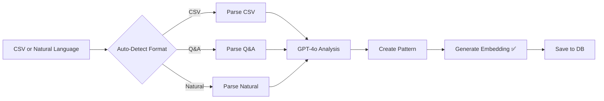

# Pattern System CSV Import Audit & Fix

## Critical Finding: Embeddings Not Generated on CSV Import

### The Problem
When patterns are imported via CSV, they are **NOT getting embeddings generated**, which means:
1. ❌ Patterns can't be found by semantic search
2. ❌ AI message watcher can't recall these patterns
3. ❌ Only keyword matching works (less accurate)

### Evidence
```sql
-- In csvImportService.ts line 334-348
INSERT INTO decision_patterns (
  pattern_type,
  pattern_signature, 
  trigger_text,
  response_template,
  confidence_score,
  auto_executable,
  execution_count,
  success_count,
  is_active,
  learned_from,
  template_variables,
  created_at
) VALUES ($1, $2, $3, $4, $5, $6, $7, $8, $9, $10, $11, NOW())
-- NO EMBEDDING FIELD!
```

Meanwhile, the pattern matching service **REQUIRES** embeddings:
```sql
-- In patternLearningService.ts line 500-512
SELECT p.*
FROM decision_patterns p
WHERE 
  p.embedding IS NOT NULL  -- REQUIRES embedding
  AND p.is_active = TRUE
  AND p.semantic_search_enabled = TRUE
```

## The Solution: Generate Embeddings During Import

### Option 1: Quick Fix - Run Embedding Script After Import
```bash
# After CSV import, run:
npm run generate-embeddings
```

This script (`generate-pattern-embeddings.ts`) will:
- Find all patterns without embeddings
- Generate embeddings using OpenAI
- Enable semantic search

### Option 2: Better Fix - Generate During Import

Update `csvImportService.ts` to generate embeddings:

```typescript
// Add to csvImportService.ts
import OpenAI from 'openai';

private openai = new OpenAI({
  apiKey: process.env.OPENAI_API_KEY
});

private async generateEmbedding(text: string): Promise<number[]> {
  const response = await this.openai.embeddings.create({
    model: 'text-embedding-3-small',
    input: text
  });
  return response.data[0].embedding;
}

private async savePattern(pattern: any): Promise<{ created: boolean; enhanced: boolean }> {
  try {
    // Generate embedding for semantic search
    const embeddingText = `${pattern.trigger} ${pattern.response}`;
    const embedding = await this.generateEmbedding(embeddingText);
    
    // Check for existing similar pattern
    const existing = await db.query(
      `SELECT id, confidence_score FROM decision_patterns 
       WHERE pattern_type = $1 
       AND (
         similarity(trigger_text, $2) > 0.7
         OR LOWER(trigger_text) LIKE LOWER($3)
       )`,
      [pattern.type, pattern.trigger, `%${pattern.trigger.substring(0, 30)}%`]
    );
    
    if (existing.rows.length === 0) {
      // Insert new pattern WITH EMBEDDING
      await db.query(
        `INSERT INTO decision_patterns (
          pattern_type,
          pattern_signature,
          trigger_text,
          response_template,
          confidence_score,
          auto_executable,
          execution_count,
          success_count,
          is_active,
          learned_from,
          template_variables,
          embedding,                    -- ADD THIS
          embedding_model,              -- ADD THIS
          embedding_generated_at,       -- ADD THIS
          semantic_search_enabled,      -- ADD THIS
          created_at
        ) VALUES ($1, $2, $3, $4, $5, $6, $7, $8, $9, $10, $11, $12, $13, NOW(), TRUE, NOW())`,
        [
          pattern.type,
          `csv_import_${Date.now()}`,
          pattern.trigger,
          pattern.response,
          pattern.confidence,
          false,
          0,
          0,
          true,
          'csv_batch_import',
          JSON.stringify(pattern.variables),
          embedding,                    // ADD THIS
          'text-embedding-3-small'      // ADD THIS
        ]
      );
      return { created: true, enhanced: false };
    }
  } catch (error) {
    logger.error('[CSV Import] Failed to save pattern', error);
    return { created: false, enhanced: false };
  }
}
```

## Natural Language Import Enhancement

### Current CSV Import Flow


### Enhanced Flow with Natural Language Support


### Adding Natural Language Support to Import

```typescript
// Enhanced import endpoint
router.post('/patterns/import', async (req, res) => {
  const { data, type } = req.body;
  
  // Auto-detect format
  const format = detectFormat(data);
  
  let patterns = [];
  
  switch(format) {
    case 'csv':
      // Existing CSV logic
      patterns = await csvImportService.processCSV(data);
      break;
      
    case 'qa':
      // Q&A pairs like "Q: What are hours? A: 9-5"
      patterns = await parseQAPairs(data);
      break;
      
    case 'natural':
      // Natural language like "When someone asks about hours, say we're open 9-5"
      patterns = await parseNaturalLanguage(data);
      break;
  }
  
  // Process all patterns the same way
  for (const pattern of patterns) {
    // Generate embedding for EVERY pattern
    const embedding = await generateEmbedding(
      `${pattern.trigger} ${pattern.response}`
    );
    
    // Save with embedding
    await savePatternWithEmbedding(pattern, embedding);
  }
  
  res.json({ success: true, patterns: patterns.length });
});

function detectFormat(data: string): 'csv' | 'qa' | 'natural' {
  // CSV has specific headers
  if (data.includes('conversationId') && data.includes(',')) {
    return 'csv';
  }
  
  // Q&A format
  if (data.includes('Q:') || data.includes('A:')) {
    return 'qa';
  }
  
  // Default to natural language
  return 'natural';
}

async function parseQAPairs(text: string) {
  const prompt = `
    Extract customer service patterns from these Q&A pairs.
    For each Q&A pair, create a pattern with:
    - trigger: the question (generalized)
    - response: the answer (with variables like {{name}})
    - type: category (booking/tech/faq/general)
    - confidence: 0.7 (manual entry default)
    
    Text:
    ${text}
    
    Return JSON array of patterns.
  `;
  
  const result = await openai.chat.completions.create({
    model: 'gpt-4o',
    messages: [{ role: 'user', content: prompt }],
    response_format: { type: 'json_object' }
  });
  
  return JSON.parse(result.choices[0].message.content).patterns;
}

async function parseNaturalLanguage(text: string) {
  const prompt = `
    Extract customer service patterns from this natural language text.
    
    Examples of what to look for:
    - "When X happens, do Y"
    - "If customer asks about X, respond with Y"
    - "Tell people X"
    - Direct statements like "Our hours are X"
    
    For each pattern found, create:
    - trigger: what the customer might say
    - response: how to respond
    - type: category
    - confidence: 0.6-0.8 based on clarity
    
    Text:
    ${text}
    
    Return JSON array of patterns.
  `;
  
  const result = await openai.chat.completions.create({
    model: 'gpt-4o',
    messages: [{ role: 'user', content: prompt }],
    response_format: { type: 'json_object' }
  });
  
  return JSON.parse(result.choices[0].message.content).patterns;
}
```

## Implementation Steps

### Step 1: Immediate Fix (5 minutes)
Run the embedding generation script for existing patterns:
```bash
cd ClubOSV1-backend
npm run generate-embeddings
```

### Step 2: Fix CSV Import (30 minutes)
1. Add embedding generation to `csvImportService.ts`
2. Update the INSERT query to include embedding fields
3. Test with a small CSV import

### Step 3: Add Natural Language Support (1 hour)
1. Add format detection to import endpoint
2. Add Q&A parser using GPT-4o
3. Add natural language parser
4. Test with various formats

### Step 4: Update UI (20 minutes)
1. Add toggle for import type (CSV/Q&A/Natural)
2. Update placeholder text based on type
3. Add examples for each format

## Testing Checklist

### After Fix Implementation:
- [ ] Import CSV data
- [ ] Check if `embedding` field is populated in database
- [ ] Test pattern matching with a message
- [ ] Verify semantic search works
- [ ] Import Q&A pairs
- [ ] Import natural language rules
- [ ] Check recall accuracy

### Database Verification:
```sql
-- Check how many patterns have embeddings
SELECT 
  COUNT(*) as total_patterns,
  COUNT(embedding) as with_embeddings,
  COUNT(CASE WHEN semantic_search_enabled THEN 1 END) as semantic_enabled
FROM decision_patterns;

-- Check recently imported patterns
SELECT 
  id,
  trigger_text,
  learned_from,
  embedding IS NOT NULL as has_embedding,
  semantic_search_enabled,
  created_at
FROM decision_patterns
WHERE learned_from = 'csv_batch_import'
ORDER BY created_at DESC
LIMIT 10;
```

## Expected Results After Fix

### Before Fix:
- CSV imports create patterns ✅
- Patterns saved to database ✅
- Keyword matching works ✅
- Semantic search fails ❌
- AI can't recall patterns ❌

### After Fix:
- CSV imports create patterns ✅
- Patterns saved to database ✅
- Keyword matching works ✅
- Semantic search works ✅
- AI recalls patterns accurately ✅
- Natural language import works ✅
- Q&A pair import works ✅

## Cost Considerations

### Embedding Generation Costs:
- ~$0.00002 per pattern (text-embedding-3-small)
- 1000 patterns = $0.02
- 10,000 patterns = $0.20
- Negligible cost for massive improvement in recall

### GPT-4o Analysis Costs:
- ~$0.01 per conversation analyzed
- Already being spent during CSV import
- Natural language parsing adds similar cost

## Conclusion

The CSV import system is 90% complete but missing the critical embedding generation step. Without embeddings:
- Patterns are stored but can't be found by semantic search
- AI message watcher can't effectively recall patterns
- System falls back to less accurate keyword matching

**Immediate Action Required:**
1. Run `npm run generate-embeddings` to fix existing patterns
2. Update CSV import to generate embeddings going forward
3. Add natural language support for easier pattern creation

This fix will make patterns fully searchable and recallable by the AI system, completing the pattern learning loop.